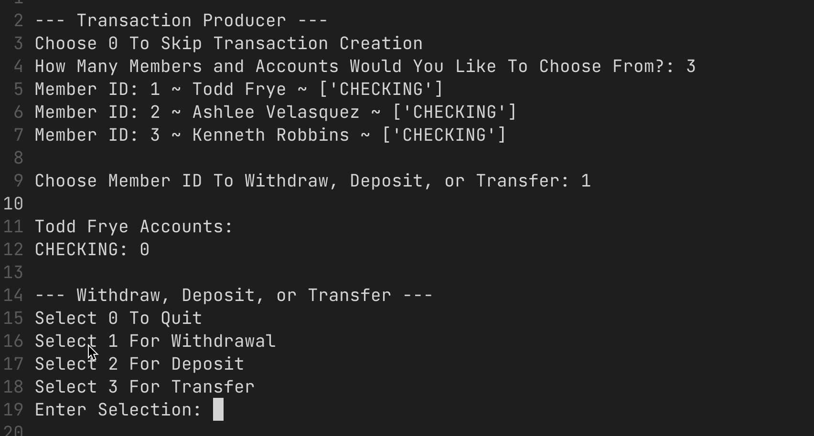

### Test Functionality Of Gateway, Microservices, and MySQL Database
---

#### Each Directory Tests Different API Microservice Functionalities.

### Setup
- pip install -r requirements.txt
- Run bearer_renew_token.py To Renew Bearer Token Before Running Python Applications Below

##### Go To Each Directory and Run The Main Python File (named the same as directory)

- Applicants ~ Choose Number Of Applicants You Would Like To Create ~
- Applications ~  Create Applications And Choose Accounts In Application ~
- Banks-and-branches ~ Create Bank / Add Branches To Existing Banks ~
- Transaction ~ Choose From Valid Members And Transfer Between Accounts ~
- Users ~  Create Admin and Member Users From Valid Non-User Members ~

##### Follow the prompts and choices to confirm proper functionality.

